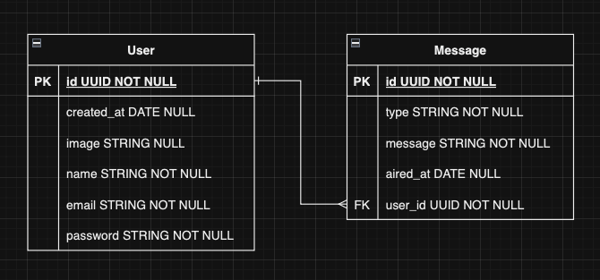

<a name="top"></a>

<h1 align="center">
  <strong><span>💧 Vapor </span></strong>
</h1>

---

<p align="center">
  <strong><span style="font-size:20px;">Server-side Swift HTTP web framework</span></strong>
</p>

---

<p align="center">
  <strong>Autor:</strong> Salva Moreno Sánchez
</p>

<p align="center">
  <a href="https://www.linkedin.com/in/salvador-moreno-sanchez/">
    
  </a>
</p>

## Índice
 
* [🛜 WebSocket API 🛜](#webSocket)
	* [Descripción](#descripcion)
		* [Características principales](#caracteristicas)
	* [Instalación](#instalacion)
	* [BBDD - Diagrama Entidad-Relación](#diagrama)
	* [WebSockets](#websockets)
		* [Comunicación en tiempo real](#comunicacion)
		* [Transmisión de texto e imágenes](#transmision)
		* [Implementación sencilla](#implementacion)
		* [Documentación](#documentacion)
	* [Endpoints](#endpoints)
		* [Sign Up](#signUp)
		* [Sign In](#signIn)
		* [Get User ID](#userId)
		* [Get User Info by ID](#userInfo)
		* [All Messages](#allMessages)
		* [Search](#search)
		* [Upload Photo](#uploadPhoto)
		* [Save URL Profile Photo](#urlPhoto)
	* [Autenticación](#autenticacion)
		* [Modelos y DTOs](#modelos)
		* [Middleware](#middleware)
		* [Controlador de Autenticación](#controller)
		* [Rutas](#routes)
* [©️ Licencia](#licencia)

<a name="webSocket"></a>
## 🛜 WebSocket API 🛜


<a name="descripcion"></a>
### Descripción

Proyecto personal que se centra en el desarrollo de una API REST que integra WebSockets para la transmisión bidireccional de datos en tiempo real. Está desarrollada en Vapor, un framework Swift para la creación de aplicaciones web y servicios.

Además, posee diversos *endpoints* destinados a la autenticación de usuarios, búsqueda en base de datos en función a un texto dado y obtención de información acerca de un usuario registrado concreto.

Por otro lado, debemos destacar el uso de la relación 1:n para relacionar usuarios con mensajes enviados por los mismos.

Su uso está pensado para ser empleada en una **aplicación de mensajería instantánea**. 🚨 Próximamente subiré su uso tanto en una app nativa en iOS como en Android.

<a name="caracteristicas"></a>
#### Características principales

* **WebSockets:** uso de WebSockets para permitir la transmisión instantánea de texto e imágenes entre clientes y el servidor. Esto ofrece una experiencia dinámica y en tiempo real para los usuarios de la aplicación, permitiéndoles enviar y recibir texto o imágenes de manera rápida y eficiente.
* **Endpoint de Búsqueda:** se incluye un *endpoint* de búsqueda sencillo que utiliza la base de datos PostgreSQL para buscar mensajes de texto almacenados. Esto proporciona a los usuarios la capacidad de buscar contenido específico dentro de la base de datos y recuperar resultados de manera rápida y precisa.
* **Fluent:** se usa Fluent, el ORM de Vapor, para manejar modelos de datos, definir relaciones entre ellos, realizar transacciones de bases de datos, ejecutar migraciones y realizar consultas complejas de manera eficiente.
* **Seguridad con JWT:** se ha desarrollado la autenticación y autorización utilizando JSON Web Tokens (JWT) para proteger los endpoints sensibles de la API. Se ha configurado el proyecto pensando en garantizar la seguridad de los datos, aplicando medidas de seguridad en los endpoints según sea necesario.

<a name="instalacion"></a>
### Instalación

Para comenzar a utilizar la API Rest, sigue estos sencillos pasos:

1. **Requisitos previos**

	* Swift 5.9
	* Vapor 4.92.4
	* Vapor Toolbox 18.7.4

2. **Clonar el Repositorio**

	```bash
	git clone <url-del-repositorio>
	```

	Asegurarse de tener instalado Git en el sistema antes de clonar el repositorio. 	Esto descargará el código fuente de la API en tu máquina local.
	
3. **Crear BBDD local**

	Asegurarse de tener una base de datos PostgreSQL activa en tu máquina local.

4. **Configuración de Variables de Entorno**

	Crea un archivo `.env` en la raíz del proyecto y rellena la siguiente información:
	
	```bash
	JWT_KEY=
	API_KEY=
	DATABASE_URL=postgresql://<usuario>@<host>/<nombre_de_la_base_de_datos>
	APP_BUNDLE_ID=

	```
	Asegurarse de completar cada variable con los valores correspondientes necesarios para el funcionamiento de la aplicación. 
	
La URL de la base de datos debe seguir el formato `postgresql://<usuario>@<host>/<nombre_de_la_base_de_datos>`.

5. **Configuración de Xcode**

	* Abre el proyecto en Xcode.
	* Edita el esquema (Scheme) del proyecto.
	* Activa la opción de "Use custom working directory" y enlaza la carpeta donde 	se encuentra el proyecto recién clonado.

6. **Ejecución del Proyecto**

	* Ejecuta el proyecto en Xcode.
	* Verifica en la terminal que el servidor se ha inicializado correctamente.

<a name="diagrama"></a>
### BBDD - Diagrama Entidad-Relación



<a name="websockets"></a>
### WebSockets

Los WebSockets desempeñan un papel fundamental en esta API al proporcionar una comunicación bidireccional y en tiempo real entre los clientes y el servidor. Esta funcionalidad ofrece una serie de ventajas y posibilidades para mejorar la experiencia del usuario y la interactividad de la aplicación.

<a name="comunicacion"></a>
#### Comunicación en tiempo real

Permiten una comunicación en tiempo real entre los clientes y el servidor. Esto significa que los usuarios pueden enviar y recibir mensajes de texto e imágenes de manera instantánea, sin demoras perceptibles. Esta capacidad de comunicación en tiempo real es especialmente útil en aplicaciones que requieren interacciones rápidas y dinámicas.

<a name="transmision"></a>
#### Transmisión de texto e imágenes

Con los WebSockets integrados en esta API, los usuarios pueden enviar tanto texto como imágenes de manera eficiente. Esto permite una amplia gama de casos de uso, desde la mensajería instantánea hasta la transmisión de contenido multimedia en tiempo real. Los mensajes de texto y las imágenes se transmiten de manera fluida y sin problemas, proporcionando una experiencia de usuario sin interrupciones.

Puntualizar que para el envío de imágenes nos debemos apoyar, en primer lugar, en un *endpoint* que se encargue de subir la imagen al servidor, que esta sea guardada (en Vapor, en la carpeta `Public`) y que devuelva la dirección donde se ha guardado para poder acceder a ella; y, a continuación, ya en la parte de cliente hacer uso de la comunicación WebSockets para notificar al resto que se ha subido una imagen en una dirección concreta o de llamadas a *endpoints* que puedan ejecutar determinadas acciones con la dirección de la imagen en el servidor como, por ejemplo, guardarla en base de datos.

<a name="implementacion"></a>
#### Implementación sencilla

La implementación de WebSockets en esta API se ha simplificado para facilitar su uso y desarrollo. Los clientes pueden conectarse al servidor WebSocket utilizando bibliotecas estándar disponibles para una variedad de lenguajes de programación. Además, la API proporciona una interfaz clara y coherente para enviar y recibir mensajes a través de WebSockets, lo que facilita la integración en aplicaciones existentes.

<a name="documentacion"></a>
#### Documentación

Para obtener más información sobre cómo utilizar los WebSockets en Vapor, invito a consultar la [documentación oficial](https://docs.vapor.codes/es/advanced/websockets/), con la que he ido desarrollando su implementación.

<a name="endpoints"></a>
### Endpoints

<a name="signUp"></a>
#### Sign Up

* **Descripción:** permite a los usuarios registrarse en la aplicación.
* **URL:** `<API_URL>/api/v1/auth/signup`
* **Método:** POST
* **Headers:**
	* `Websockets-ApiKey`: API_KEY
* **Body:**
	* `name`: nombre del usuario
	* `email`: correo electrónico del usuario
	* `password`: contraseña del usuario
* **Respuesta:**

	```json
	{
  		"accessToken": "<accessToken>"
	}
	``` 

<a name="signIn"></a>
#### Sign In

* **Descripción:** permite a los usuarios iniciar sesión en la aplicación.
* **URL:** `<API_URL>/api/v1/auth/signin`
* **Método:** GET
* **Headers:**
	* `Websockets-ApiKey`: API_KEY
	* `Authorization`: Basic Auth + email + password
* **Respuesta:**

	```json
	{
  		"accessToken": "<accessToken>"
	}
	```

<a name="userId"></a>
#### Get User ID

* **Descripción:** permite obtener el ID del usuario extraído de la base de datos.
* **URL:** `<API_URL>/api/v1/user/id`
* **Método:** GET
* **Headers:**
	* `Websockets-ApiKey`: API_KEY
	* `Authorization`: Bearer + Access Token
	* `Email`: email del usuario
* **Respuesta:**

	```json
	{
  		"id": "<userId>"
	}
	```

<a name="userInfo"></a>
#### Get User Info by ID

* **Descripción:** permite obtener de la base de datos la información esencial de perfil del usuario: email, nombre de usuario y la imagen de perfil en el caso de tener una guardada.
* **URL:** `<API_URL>/api/v1/user/info/:id`
* **Método:** GET
* **Headers:**
	* `Websockets-ApiKey`: API_KEY
	* `Authorization`: Bearer + Access Token
* **Respuesta:**

	```json
	{
  		"email": "<email>",
  		"userName": "<userName>",
  		"image": "<profileImage>" // Opcional
	}
	```

<a name="allMessages"></a>
#### All Messages

* **Descripción:** obtención de todos los mensajes guardados en base de datos y ordenados de menor a mayor en función a su fecha de publicación.
* **URL:** `<API_URL>/api/v1/messages`
* **Método:** GET
* **Headers:**
	* `Websockets-ApiKey`: API_KEY
	* `Authorization`: Bearer + Access Token
* **Respuesta:**

	```json
	[
		{
	  		"id": "<messageId>",
	  		"message": "<message>",
	  		"airedAt": "<publicationDate>",
	  		"type": "<messageType>",
	  		"user": "<userId>" // User Foreign Key
		},
		
		// ...
	]
	```

<a name="search"></a>
#### Search

* **Descripción:** permite hacer búsquedas de mensajes que contienen la *query* introducida en la llamada como parámetro.
* **URL:** `<API_URL>/api/v1/search`
* **Método:** GET
* **Headers:**
	* `Websockets-ApiKey`: API_KEY
	* `Authorization`: Bearer + Access Token
* **URL Params:**
	* `search`: texto a buscar entre los mensajes guardados.
* **Respuesta:**

	```json
	[
		{
	  		"id": "<messageId>",
	  		"message": "<message>",
	  		"airedAt": "<publicationDate>",
	  		"type": "<messageType>",
	  		"user": "<userId>" // User Foreign Key
		},
		
		// ...
	]
	```
	
<a name="uploadPhoto"></a>
#### Upload Photo

* **Descripción:** permite guardar una imagen en la carpeta pública del servidor.
* **URL:** `<API_URL>/api/v1/photo/upload`
* **Método:** POST
* **Headers:**
	* `Websockets-ApiKey`: API_KEY
	* `Authorization`: Bearer + Access Token
* **URL Params:**
	* `type`: sección desde la que se envía la imagen. En este caso, desde el muro de publicaciones (`wall`) o desde el perfil del usuario (`profile`). Sirve, además, para clasificar las imágenes en carpetas según el tipo indicado.
* **Body:**
	* Enviar la imagen en formato `Data`.
* **Respuesta:**

	```json
	"<imageURL>"
	```

<a name="urlPhoto"></a>
#### Save URL Profile Photo

* **Descripción:** permite guardar en base de datos la dirección de la imagen previamente guardada. En este caso, está destinado a guardar la dirección de la imagen de perfil del usuario.
* **URL:** `<API_URL>/api/v1/photo/profile`
* **Método:** POST
* **Headers:**
	* `Websockets-ApiKey`: API_KEY
	* `Authorization`: Bearer + Access Token
* **Body:**
	* `email`: correo electrónico del usuario.
	* `image`: dirección de la imagen en el servidor.
* **Respuesta:**

	```json
	"Photo saved successfully"
	```

<a name="autenticacion"></a>
### Autenticación

La seguridad es una parte fundamental en cualquier aplicación web. En esta sección, se describe cómo se maneja la autenticación en la API utilizando JSON Web Tokens (JWT) y middleware de API Key para garantizar un acceso seguro a los endpoints.

<a name="modelos"></a>
#### Modelos y DTOs

##### Modelo `User`

El modelo `User` representa a los usuarios de la aplicación. Contiene propiedades como nombre, correo electrónico y contraseña. Además, se definen estructuras para la creación de usuarios y la representación pública de los mismos.

##### JWTToken

El struct `JWTToken` representa los tokens JWT utilizados para autenticar a los usuarios. Se definen distintos tipos de tokens (de acceso y de actualización), así como métodos para generar y verificar tokens.

<a name="middleware"></a>
#### Middleware

##### APIKeyMiddleware

El middleware `APIKeyMiddleware` garantiza que todas las solicitudes incluyan una clave de API válida en los encabezados. Esto ayuda a proteger la API contra accesos no autorizados.

<a name="controller"></a>
#### Controlador de Autenticación

El `AuthController` maneja las solicitudes relacionadas con la autenticación de usuarios. Contiene métodos para registrarse e iniciar sesión.

<a name="routes"></a>
#### Rutas

Las rutas están protegidas por el middleware `APIKeyMiddleware`, lo que garantiza que solo las solicitudes con una clave de API válida sean procesadas. Además, algunas rutas están protegidas por autenticación JWT para garantizar que solo los usuarios autenticados puedan acceder a ciertos recursos.

```swift
// Ejemplo de cómo se registran los controladores en las rutas
func routes(_ app: Application) throws {
    try app.group("api", "v1") { builder in
        try builder.group(APIKeyMiddleware()) { builder in
            try builder.register(collection: AuthController())
            // Otros controladores...
        }
    }
}
```

<a name="licencia"></a>
## ©️ Licencia

Este proyecto está bajo la Licencia MIT - ver el archivo [LICENSE.md](https://github.com/salvaMsanchez/Vapor-WebSocketAPI/blob/main/LICENSE.md) para más detalles.

---

[Subir ⬆️](#top)